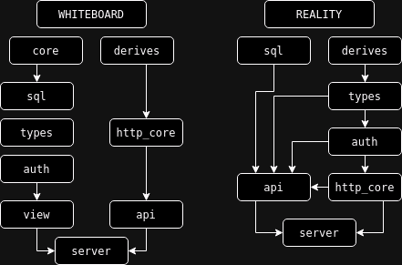

<p>
    
</p>

# BANTER Workspace

BANTER Web Server - Rust Workspace

## Authentication

users have 4 roles: `admin`, `sales`, `customer`, `driver`

`driver` have specific data stored in `metadata`

`users` is an employee of single `warehouse`

## Bussiness Logic

### Orders

`users` have many `orders`

`orders` have many `tracings`

`tracings` status can be `warehouse`, `driver`, or `complete`

`manifests` have many `orders`

`order_status` is temporary record for easier query

`order_status` reference to single `orders` and latest corresponding `tracings`

`order_status` recreated every **event**, and removed when `orders` completed

### Events

- Create Order
    - corresponding `users` snapshoted
    - `tracing` created
    - `order_status` created

- Gateway Out
    - corresponding `users` snapshoted
    - `tracings` for every `orders` created
    - `manifests` created
    - `order_status` recreated

- Gateway In
    - corresponding `users` snapshoted
    - `tracings` for every `orders` created
    - `manifests` completed
    - `order_status` recreated

- Completion
    - corresponding `users` snapshoted
    - `tracings` for every `orders` created
    - `order_status` removed

## Anonymous Subject

some subject can be anonymous, that is subject which does not belong
to registered user.

the advantage is users can create order without need to be registered

since any referenced user is stored as snapshot,
we can simply create a snapshot

> *anonymus* will be refered as *anon*

`sales` cannot be referenced as `anon`

when creating order, `sender` and `receiver` can be `anon`

gateway out, `driver` can be `anon`

## Historical Data

**`orders`, `tracings`, `manifests` is immutable and will never change**

little exception for `manifests`, it will only become immutable
after completion

`orders` references user data, but user data may change, that violate
immutability. So, every new `orders`, user will be **snapshoted**, stored
in separate table, and `orders` will reference to snapshot instead.

`snapshot` is created first when `users` created, then recreated
when corresponding `users` updated

## Rust Packages

### Shared

shared bussiness logic and app utilities

- `http-core`, shared abstraction over http
- `types`, bussiness logic structs
- `sql`, all sql queries
- `auth`, authentication

### Router

bridge runtime and bussiness logic

- `api`, router for json response

### Entry Points

the root package is the entry points, it start
tokio runtime, tcp listener, and db pool

## Usage

### Prerequisite

- `.env` containing DATABASE_URL for postgres

```bash
echo 'DATABASE_URL=postgres' > .env
```

### Server

root package is the entry point:

```bash
# Debug
cargo run
# Release
cargo run --release
```

### Database

migrations are store in `migrations/`

create/drop the database at DATABASE_URL

```bash
sqlx database create
sqlx database drop
```

run/revert migration

```bash
sqlx migrate run
sqlx migrate revert
```

